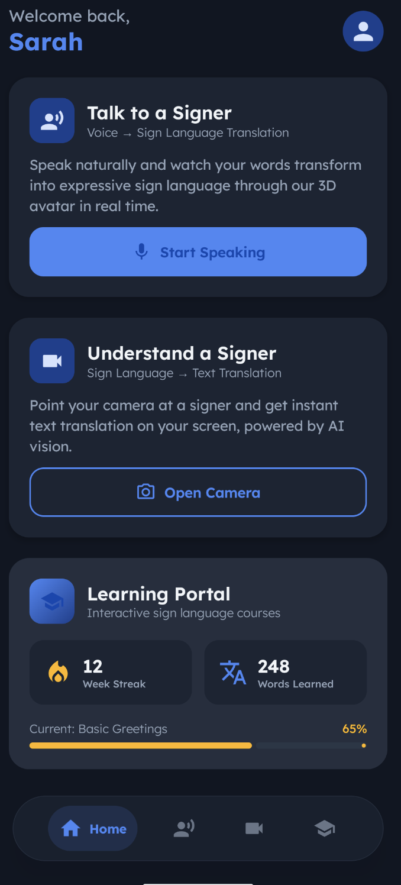
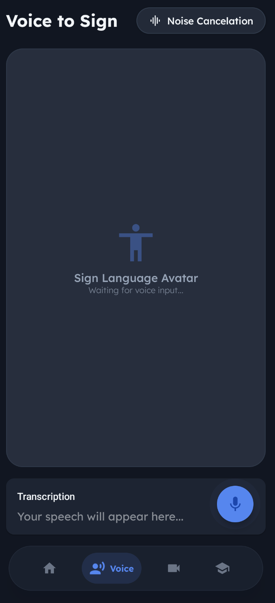
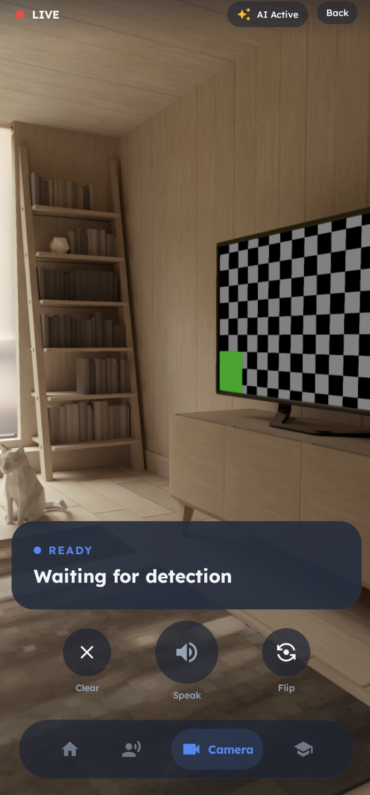
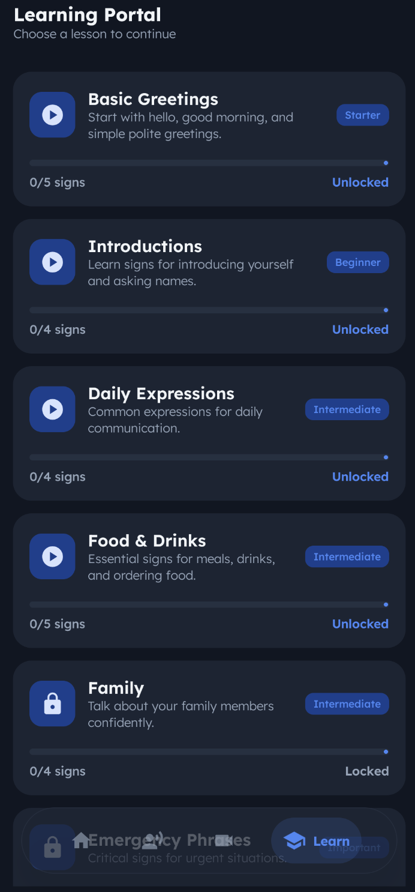
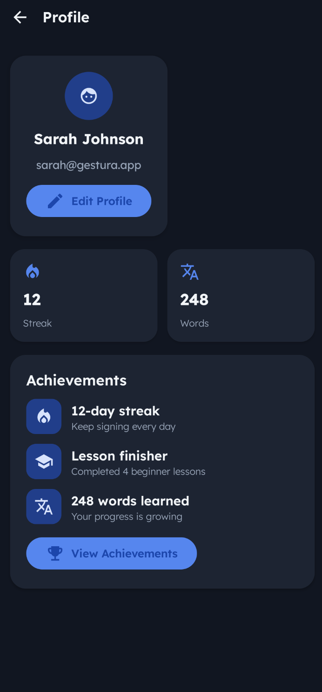
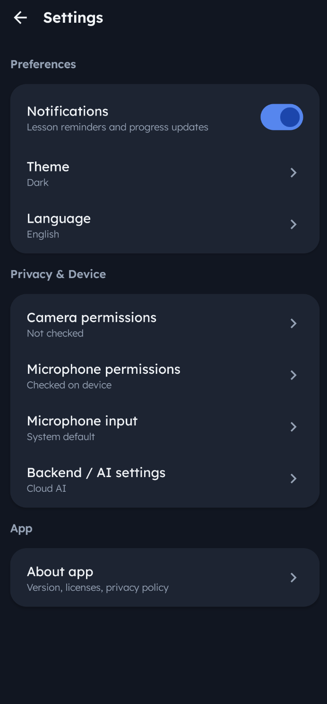
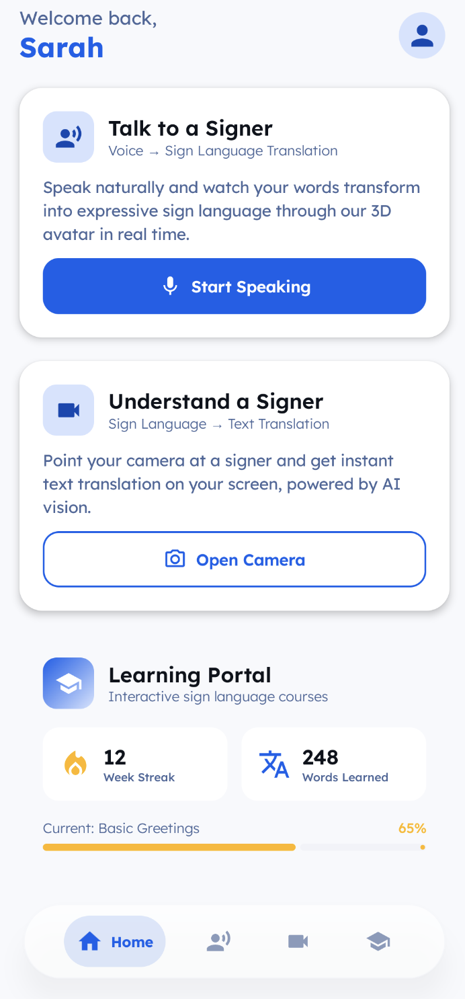

<div align="center">
  

  # 🤟 Gestura

  **AI-Powered Bidirectional Sign Language Translation & Interactive E-Learning Platform**

  [](https://www.android.com/)
  [](https://kotlinlang.org/)
  [](https://developer.android.com/jetpack/compose)
  [](https://www.python.org/)
  [](https://fastapi.tiangolo.com/)
  [](https://mediapipe.dev/)

  > ⚠️ **Academic Project** — Developed as an Innovation Project (PI) at BDCC S4.

</div>

<br />

---

## 📖 Overview

**Gestura** is an innovative accessibility platform designed to reduce the communication gap between deaf and hearing individuals. It combines speech recognition, semantic matching, sign-language motion data, and 3D avatar animation to translate spoken words into visual sign animations.

The current final demo focuses on the **Voice-to-Sign** pipeline. The Android application captures speech, converts it into text, performs local semantic matching, and loads pre-generated upper-body 3D avatar animations directly from app assets.

Unlike the early prototype, the final app does **not require a running backend server** for the Voice-to-Sign demo. The backend folder is now mainly used as an offline asset-generation workspace for extracting landmarks from WLASL videos, cleaning skeleton data, retargeting motion in Blender, and producing optimized FBX avatar animations.

The project evolved through several stages:

1. **Initial lookup-based prototype** using `asl_landmarks.json`
2. **MediaPipe landmark extraction** from WLASL sign-language videos
3. **Skeleton cleaning and hand identity stabilization**
4. **Blender retargeting** to a Ready Player Me / Wolf3D avatar
5. **Upper-body FBX export**
6. **Local Android semantic matching + avatar playback**

---

## ✨ Key Features

### 🔄 Bidirectional Translation

- **Sign-to-Text:** The app includes a camera-based Sign-to-Text interface designed for sign detection and future real-time translation experiments.
- **Voice-to-Sign:** Captures spoken English, converts it into text using Android SpeechRecognizer, maps recognized words to available signs, and displays corresponding 3D upper-body avatar animations.

### 🎓 Interactive Learning Portal

- **Learning UI:** Includes lesson-oriented screens and educational flow for sign-language practice.
- **Progress-Oriented Experience:** Designed to support practice, progress tracking, and feedback as the project expands.

### 🧠 Local Semantic Matching

- Exact word matching
- Synonym fallback using `gestura_synonyms.json`
- Simple similarity fallback for limited vocabulary coverage
- Example:
  - `soccer → football`
  - `mom → mother`
  - `puppy → dog`
  - `yeah → yes`

### 🧍 3D Avatar Animation

- Uses a Ready Player Me / Wolf3D avatar
- Animations generated from real WLASL sign-language videos
- Motion retargeted in Blender
- Final assets exported as trimmed upper-body FBX files
- Avatar materials and colors are preserved

### 🎤 Speech & Input Enhancements

- Android SpeechRecognizer integration
- Noise-aware speech mode
- Microphone permission management
- Microphone input selection UI for internal/external microphone support

---

## 🎤 Voice to Sign — How It Works

```text
🎤 Speak
   ↓
📱 Android SpeechRecognizer
   ↓
📝 Transcription text
   ↓
🧠 Local semantic matching
   ↓
🔢 video_id lookup
   ↓
🎞️ Local FBX asset
   ↓
🧍 3D upper-body avatar animation
```

User speaks naturally.

Android's native SpeechRecognizer captures speech and displays the transcription.

The recognized text is split into words.

Each word is processed locally by the semantic matcher.

Matching priority:

- exact word match
- synonym lookup from `gestura_synonyms.json`
- simple similarity fallback

The matched canonical word is mapped to a WLASL `video_id` using `video_id_to_word.json`.

The app loads the corresponding local FBX animation:

```
app/src/main/assets/upper_body_trimmed/{video_id}_upper.fbx
```

The 3D avatar displays the sign animation using the trimmed upper-body version.

Example:

```
User says: "soccer"
↓
Semantic matcher maps "soccer" → "football"
↓
football → video_id 69331
↓
loads upper_body_trimmed/69331_upper.fbx
```

> 💡 **Efficiency Highlight:** The final app runs locally without requiring a backend server. Translation matching and avatar asset loading are performed directly on the Android device.

---

## 🧠 Semantic Matching

Gestura uses a lightweight semantic matching layer to make the limited sign vocabulary more flexible.

The system uses:

**Exact Match**

If the spoken word exists directly in the available vocabulary, it is used immediately.

**Synonym Match**

If the word is not found, the app checks `gestura_synonyms.json`.

Example:

- `soccer → football`
- `mom → mother`
- `ill → sick`

**Similarity Fallback**

If no synonym is found, a simple fallback checks partial similarity between the input word and known vocabulary words.

This can be described as a vector-inspired semantic retrieval layer. It is not a full FAISS/Pinecone-style vector database yet, but it follows the same idea of mapping user input to the closest available sign representation while staying constrained and safe for a limited vocabulary.

---

## 🧍 Avatar Asset Generation Pipeline

The current avatar system is generated from real sign-language motion data instead of using the old `asl_landmarks.json` lookup approach.

```
WLASL videos
   ↓
MediaPipe landmark extraction
   ↓
Clean skeleton generation
   ↓
Hand identity stabilization
   ↓
Avatar-ready skeleton JSON
   ↓
Blender retargeting
   ↓
Animated FBX
   ↓
Upper-body trimming
   ↓
Android local assets
```

### Main Backend Pipeline

The backend folder is located at:

```bash
/backend
```

Important folders:

```
backend/data/raw_videos/
backend/data/landmarks/
backend/data/clean_skeletons/
backend/data/avatar_skeletons/
backend/data/animated_fbx/
backend/data/animated_fbx/upper_body_trimmed/
```

### Main Steps

#### 1. Extract landmarks

MediaPipe is used to extract pose and hand landmarks from WLASL videos.

```bash
python3 extract_landmarks.py \
  --video data/raw_videos/69413.mp4 \
  --output data/landmarks/69413.json
```

#### 2. Build clean skeleton

The raw landmarks are cleaned, smoothed, and prepared for stabilization.

```bash
python3 build_clean_skeleton.py \
  --input_json data/landmarks/69413.json \
  --output_json data/clean_skeletons/69413_clean.json \
  --no_attach_hands \
  --max_hand_gap 4 \
  --edge_hand_gap 4 \
  --hand_smoothing_window 2
```

#### 3. Stabilize hand identity and attach wrists

```bash
python3 stabilize_hand_identity.py \
  --input_json data/clean_skeletons/69413_clean.json \
  --output_json data/avatar_skeletons/69413_avatar.json \
  --attach_hands \
  --wrist_lock 1.0
```

#### 4. Retarget to FBX using Blender

```bash
"/Applications/Blender.app/Contents/MacOS/Blender" --background \
  --python retarget_to_fbx_v3_bendonly.py -- \
  --fbx avatar/source/Wolf3D_readyplayerme_male_01.fbx \
  --motion_json data/avatar_skeletons/69413_avatar.json \
  --output_fbx data/animated_fbx/69413.fbx
```

#### 5. Trim to upper body

```bash
"/Applications/Blender.app/Contents/MacOS/Blender" --background \
  --python postprocess_avatar_fbx.py -- \
  --input_fbx data/animated_fbx/69413.fbx \
  --output_fbx data/animated_fbx/upper_body_trimmed/69413_upper.fbx \
  --start_frame 5 \
  --end_frame 80 \
  --cut_below_z 1.05
```

The final FBX files are copied into:

```
app/src/main/assets/upper_body_trimmed/
```

---

## 🛠️ Technical Architecture & Stack

### 📱 Mobile Client (Android)

| Layer | Technology |
|---|---|
| Language | Kotlin |
| UI | Jetpack Compose + Material Design 3 |
| Navigation | Compose Navigation |
| Speech | Android SpeechRecognizer |
| Semantic Matching | Local Kotlin matcher using JSON assets |
| Data Storage | Local assets |
| Avatar Assets | Upper-body FBX animations |
| Camera | CameraX API |
| Theme | Dark / Light mode support |

### 🧠 Local Runtime Assets

| Asset | Purpose |
|---|---|
| `video_id_to_word.json` | Maps WLASL video IDs to available words |
| `gestura_synonyms.json` | Maps aliases/synonyms to canonical words |
| `upper_body_trimmed/*.fbx` | Final local avatar animations |

### 🧪 Offline Backend / Asset Tooling

| Layer | Technology |
|---|---|
| Language | Python |
| Computer Vision | MediaPipe Pose + Hands |
| Dataset | WLASL videos |
| Retargeting | Blender Python |
| Avatar | Ready Player Me / Wolf3D FBX |
| Output | Trimmed upper-body FBX animations |

> **Note:** FastAPI and `asl_landmarks.json` were used in earlier prototypes. The current final Voice-to-Sign demo runs locally inside the Android app.

---

## 🛠️ Developer Tools

To ensure high-fidelity animations, Gestura includes several offline development tools located in the `backend/` directory.

- **`extract_landmarks.py`**: Extracts MediaPipe pose and hand landmarks from WLASL videos.
- **`build_clean_skeleton.py`**: Cleans and smooths extracted skeleton data.
- **`stabilize_hand_identity.py`**: Stabilizes left/right hand identity and optionally attaches hands to wrists.
- **`visualize_clean_overlay_3d.py`**: Generates visual overlays to verify skeleton quality.
- **`retarget_to_fbx_v3_bendonly.py`**: Retargets avatar-ready skeletons to the Ready Player Me / Wolf3D avatar.
- **`postprocess_avatar_fbx.py`**: Trims exported FBX files to upper-body animations.
- **`tester.py` / topology tools**: Earlier diagnostic tools used for inspecting hand landmarks and topology.

---

## 🌐 API Reference / Legacy Backend

The initial prototype used a FastAPI backend with endpoints such as `/health`, `/vocabulary`, `/lookup/{word}`, and `/translate`.

That approach has been replaced in the final demo by a local Android pipeline using:

```
SpeechRecognizer
→ SemanticMatcher
→ local JSON assets
→ local FBX avatar animations
```

The FastAPI backend and `asl_landmarks.json` are kept only as legacy/prototype references and are not required to run the final Voice-to-Sign demo.

---

## 🚀 Getting Started

### Prerequisites

- Android Studio Ladybug or later
- Android SDK version 35
- Physical Android device recommended
- Python 3.10+ only if you want to regenerate landmark/FBX assets
- Blender 4.5.8 LTS only if you want to regenerate avatar animations

### 1. Clone the repository

```bash
git clone https://github.com/AbdelaliSaadali/Gestura.git
cd Gestura
```

### 2. Run the Android app

1. Open the `Gestura` folder in Android Studio
2. Let Gradle sync and download dependencies
3. Connect a physical Android device or configure an emulator
4. Click **Run ▶️**

> The final Voice-to-Sign demo does not require starting a backend server.

### 3. Verify local assets

The app expects these files inside:

```
app/src/main/assets/
```

Required assets:

```
gestura_synonyms.json
video_id_to_word.json
upper_body_trimmed/
```

Example:

```
app/src/main/assets/
├── fonts/
├── gestura_synonyms.json
├── video_id_to_word.json
└── upper_body_trimmed/
    ├── 69206_upper.fbx
    ├── 69331_upper.fbx
    └── ...
```

### 4. Optional: Regenerate avatar assets

If you want to regenerate the FBX animations, use the backend pipeline:

```bash
cd backend
```

Then run extraction, cleaning, stabilization, retargeting, and postprocessing as described in the [Avatar Asset Generation Pipeline](#-avatar-asset-generation-pipeline) section.

---

## 📁 Project Structure

```
GESTURA/
├── app/                                      ← Android Kotlin app
│   └── src/main/
│       ├── java/com/gestura/app/
│       │   ├── screens/                      ← Home, VoiceToSign, SignToText, Learning, Settings
│       │   ├── data/
│       │   │   └── semantic/                 ← Local semantic matching
│       │   └── navigation/                   ← Compose NavGraph & Routes
│       └── assets/
│           ├── fonts/
│           ├── gestura_synonyms.json         ← Synonym / semantic fallback dictionary
│           ├── video_id_to_word.json         ← WLASL video ID → word mapping
│           └── upper_body_trimmed/           ← Final FBX avatar animations
│
├── backend/                                  ← Offline asset-generation workspace
│   ├── extract_landmarks.py                  ← MediaPipe landmark extraction
│   ├── build_clean_skeleton.py               ← Skeleton cleaning
│   ├── stabilize_hand_identity.py            ← Hand identity stabilization
│   ├── retarget_to_fbx_v3_bendonly.py        ← Blender avatar retargeting
│   ├── postprocess_avatar_fbx.py             ← Upper-body FBX trimming
│   ├── data/
│   │   ├── raw_videos/                       ← WLASL videos
│   │   ├── landmarks/                        ← Extracted MediaPipe landmarks
│   │   ├── clean_skeletons/                  ← Cleaned skeleton JSON
│   │   ├── avatar_skeletons/                 ← Avatar-ready skeleton JSON
│   │   └── animated_fbx/
│   │       └── upper_body_trimmed/           ← Generated upper-body FBX files
│   └── avatar/
│       └── source/
│           └── Wolf3D_readyplayerme_male_01.fbx
│
├── demo/                                     ← Project screenshots & recordings
└── README.md
```

---

## 📸 Screenshots

|  |  |  |  |  |  |  |
|---|---|---|---|---|---|---|
| Home Page | Voice to Sign | Sign to Text | Learning Portal | Profile | Settings | Light Mode

---

## 🤝 Contributing

Contributions are welcome! Please feel free to submit a Pull Request.

1. Fork the project
2. Create your feature branch (`git checkout -b feature/AmazingFeature`)
3. Commit your changes (`git commit -m 'Add some AmazingFeature'`)
4. Push to the branch (`git push origin feature/AmazingFeature`)
5. Open a Pull Request

---

## 👥 Team

This project was developed as an Innovation Project (PI) at BDCC S4.

| Contributor | Responsibility |
|---|---|
| Abdelali Saadali | Voice-to-Sign feature — Android UI, SpeechRecognizer integration, semantic matching layer, WLASL landmark extraction pipeline, Blender avatar retargeting, and upper-body FBX avatar asset generation |

---

## 📝 License

Distributed under the MIT License. See `LICENSE` for more information.